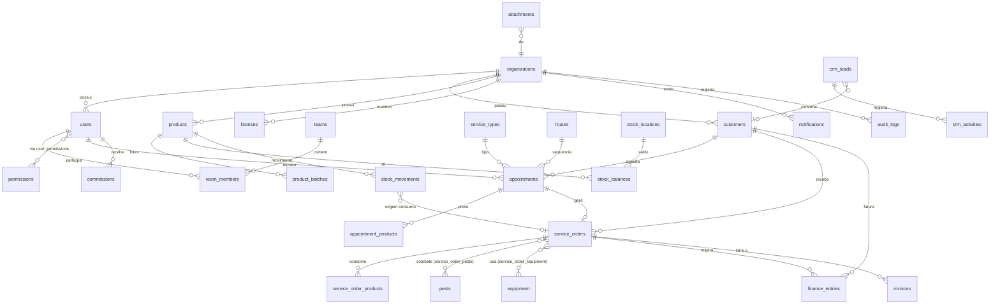

# Banco de dados — Na Mira · Controle de Pragas

Modelagem PostgreSQL normalizada, multi-tenant e auditável.
Arquivos: [`db/schema.sql`](../db/schema.sql) (DDL), [`db/rls.sql`](../db/rls.sql)
(Row Level Security), [`db/auth_hook.sql`](../db/auth_hook.sql) (claims do JWT)
e [`db/link_admins.sql`](../db/link_admins.sql) (vincula usuários já criados em
Authentication → Users a uma linha em `public.users`).

> **Ordem de aplicação no Supabase**: `schema.sql` → `rls.sql` → `auth_hook.sql`
> → registrar o hook em Authentication → Hooks → Custom Access Token
> (selecionar `public.custom_access_token_hook`) → criar os usuários reais em
> Authentication → Users → `link_admins.sql` (ou `seed.sql`, se for usar dados
> de demonstração). Sem o hook registrado no painel, as políticas de RLS negam
> tudo (fail-closed) — o app não funciona, mas nenhum dado vaza.
>
> Depois disso, faça o deploy de `supabase/functions/convidar-tecnico`
> (`supabase functions deploy convidar-tecnico`) — é o que permite cadastrar
> novos funcionários **direto pela tela** "Novo técnico" com login de verdade
> (a pessoa recebe um e-mail do próprio Supabase pra escolher a senha), sem
> precisar mais criar manualmente em Authentication → Users + `link_admins.sql`
> pra cada novo funcionário. Ver docs/ARCHITECTURE.md §3.4.

## Fase 2 — dados compartilhados por módulo

Cada módulo migrado de `localStorage` para dados compartilhados de verdade
(ver `docs/ARCHITECTURE.md` §3.1) ganha um `db/migrate_<modulo>_realtime.sql`
próprio — roda depois do setup acima, sempre que o módulo entrar em produção.
Já migrados:
- **Clientes** (`db/migrate_customers_realtime.sql`) — completa colunas do
  cadastro completo que não existiam na tabela original e habilita Realtime
  na tabela `customers`.
- **Agenda** (`db/migrate_appointments_realtime.sql`) — completa colunas de
  execução em campo (`fixed_time`, `technician_notes`, `photos`,
  `technician_signature`, `products`) e habilita Realtime na tabela
  `appointments`. Atenção: `photos` grava as fotos como data URL (base64)
  direto na linha, igual já fazia no `localStorage` — funciona, mas não
  escala bem; migrar pra Supabase Storage (guardando só a URL do arquivo) é
  um follow-up conhecido, ainda não feito.
- **16 módulos de cadastro simples** (`db/migrate_entitystores_realtime.sql`)
  — Usuários, Departamentos, Produtos, Financeiro, Equipamentos, Veículos,
  Serviços, Não-conformidades, Pragas, Áreas tratadas, Tipos de armadilha,
  Licenças, Contas a pagar recorrentes, Contas bancárias, Cheques,
  Empréstimos — todos migrados de uma vez, via a fábrica genérica
  `createEntityStore` (ver `docs/ARCHITECTURE.md` §3.2). Cria as 7 tabelas
  que ainda não existiam (`departments`, `non_conformities`, `trap_types`,
  `recurring_payables`, `bank_accounts`, `checks`, `loan_investments`),
  completa colunas que faltavam em `users`/`products`/`equipment`/`vehicles`/
  `finance_entries` e habilita Realtime nas 16 tabelas.

  **Rodar nesta ordem exata**, uma vez só, num projeto que já tenha
  `schema.sql`/`rls.sql` aplicados:
  1. `db/migrate_ids_to_text.sql` — corrige um bug de tipagem que já afetava
     Clientes/Agenda: `id` estava `uuid`, mas o app sempre gera o próprio id
     no cliente (`"c-3f9k2z1"`, não um UUID) — sem isso, criar um registro
     novo em modo Supabase falhava com "invalid input syntax for type uuid".
     Ver `docs/ARCHITECTURE.md` §3.2 para o porquê.
  2. `db/migrate_entitystores_realtime.sql` — cria/completa as tabelas acima.
  3. `db/rls.sql` de novo — a política `org_isolation` é criada por
     introspecção (toda tabela com `org_id`), então as 7 tabelas novas só
     ficam protegidas depois desse re-run. Idempotente.
- **Ordens de Serviço** (`db/migrate_serviceorders_realtime.sql`) — corrige o
  tipo do id (mesmo bug do item acima, específico de `service_orders` e de
  quem referencia `service_orders(id)`: `service_order_products`,
  `service_order_pests`, `service_order_equipment`, `stock_movements`,
  `checklist_runs`, `finance_entries`, `commissions`, `invoices`), completa
  as colunas da OS "avançada" (equipe, pagamento, garantia, recorrência,
  assinaturas…) que não existiam em `schema.sql`, e habilita Realtime.
  Rodar depois dos dois scripts acima.
- **Estoque** (`db/migrate_stock_realtime.sql`) — corrige o tipo de
  `stock_balances.id`/`location_id` (mesmo motivo dos itens acima;
  `location_id` nunca teve uma tabela `stock_locations` de verdade por trás
  no app, então a FK "aspiracional" foi removida em vez de recriada), cria
  `stock_requests` e `equipment_requests` (não existiam), habilita Realtime
  nas três. Lembre de rodar `db/rls.sql` de novo depois (tabelas novas).
- **CRM** (`db/migrate_crm_realtime.sql`) — corrige o tipo de `crm_leads.id`
  (mesmo motivo dos itens acima) e habilita Realtime. **Mensagens de
  WhatsApp (`messagesStore.ts`) ficaram de fora de propósito** — é uma
  simulação (`WhatsMessage`, comentário no próprio arquivo: "para produção,
  troque send/markDelivered por chamadas à API do WhatsApp"), não dado real
  que faça sentido sincronizar entre usuários agora.
- **Financeiro complementar** (`db/migrate_financeiro2_realtime.sql`) —
  Notas fiscais emitidas (`invoices`: corrige `id`/`number` — igual aos
  itens acima, mais colunas de retorno do provedor fiscal), Transações
  bancárias e Fechamento de caixa (`bank_transactions`/`cash_closings`,
  tabelas novas). Precisa rodar depois de `migrate_entitystores_realtime.sql`
  (usa `bank_accounts`).
- **App do Técnico** (`db/migrate_campo_realtime.sql`) — Abastecimento de
  veículo (`vehicle_fuel_logs`: schema original não tinha `org_id`/
  `technician_id`, obrigatórios no domínio, nem `odometer_start`/
  `odometer_end`/`amount`/`notes` — completados direto em `schema.sql`),
  Ponto (`time_clock_entries`, tabela nova) e Armadilhas/MIP
  (`trap_devices`/`trap_inspections`, tabelas novas — `trap_inspections` não
  tem `org_id` próprio, herda o isolamento via `trap_id`).

- **Auditoria, Perfil da empresa, Configurações** (`db/migrate_org_realtime.sql`)
  — último lote. `auditStore` é insert-only (log de auditoria). `orgProfileStore`
  e `settingsStore` são **singletons** (uma linha por organização — mapeiam
  pra `organizations` e `fiscal_settings`, sem lista/CRUD) — padrão novo,
  ver `docs/ARCHITECTURE.md` §3.3. `fiscal_settings` ganhou todas as colunas
  do `FiscalConfig` completo (provider, ambiente, retenções…) mais
  assinaturas eletrônicas e emergência/CIT, que o app sempre persistiu
  junto na mesma chave.

**Ordem completa de todos os scripts da Fase 2** (rodar do zero, um de cada
vez, nesta ordem — cada um depende de colunas/tabelas do anterior):
1. `db/migrate_ids_to_text.sql`
2. `db/migrate_entitystores_realtime.sql`
3. `db/migrate_serviceorders_realtime.sql`
4. `db/migrate_stock_realtime.sql`
5. `db/migrate_crm_realtime.sql`
6. `db/migrate_financeiro2_realtime.sql` (precisa de `bank_accounts`, criada no passo 2)
7. `db/migrate_campo_realtime.sql`
8. `db/migrate_org_realtime.sql`
9. `db/rls.sql` de novo (protege todas as tabelas novas — a política é criada por introspecção)

Com isso, **todos os módulos do app estão migrados** — não sobra nenhuma
store em localStorage-only (exceto `messagesStore`, de propósito — ver acima).

**Incrementos pós-Fase 2** (rodar depois da lista acima, na ordem em que
foram criados):
- `db/migrate_serviceorders_time.sql` — adiciona `service_orders.execution_time`
  (horário do serviço, `HH:MM`) — sem ele o agendamento vinculado à OS caía
  sempre em meia-noite, e a roteirização não conseguia posicionar a visita.
- `db/migrate_feedback_cliente.sql` — `products.report_label` (nome comercial
  vs. princípio ativo nos laudos), `customers.room_count` (quantidade de
  cômodos) e `recurring_payables.start_date` (primeiro vencimento com
  dia/mês/ano, antes só existia o dia).

## Convenções

- **Multi-tenant** por `org_id` em toda tabela de negócio (habilite RLS no Supabase).
- Chaves primárias **UUID** (`gen_random_uuid()`).
- **timestamptz** para datas/horas; `created_at` / `updated_at` (trigger automático).
- **ENUMs** para estados de domínio; catálogos em tabelas quando extensíveis.
- Soft-delete via `deleted_at` onde há necessidade de histórico.

## Domínios (ENUMs)

| ENUM | Valores |
| --- | --- |
| `user_role` | admin, supervisor, financeiro, atendimento, estoque, tecnico |
| `customer_type` | pf, pj |
| `appointment_status` | programada, agendado, confirmado, em_deslocamento, em_atendimento, finalizado, cancelado, reagendado |
| `appointment_priority` | baixa, normal, alta, urgente |
| `service_order_status` | rascunho, em_andamento, concluida, cancelada |
| `stock_movement_type` | entrada, saida, transferencia, consumo, perda, ajuste, devolucao |
| `stock_location_kind` | central, tecnico, veiculo |
| `finance_entry_type` | receita, despesa |
| `finance_entry_status` | pendente, pago, atrasado, cancelado |
| `crm_stage` | novo_contato, orcamento, negociacao, follow_up, ganho, perdido |
| `equipment_status` | disponivel, em_uso, manutencao, inativo |

## Diagrama de relacionamentos (visão macro)



## Tabelas por área

### Núcleo & acesso
`organizations`, `users`, `permissions`, `role_permissions`, `user_permissions`,
`teams`, `team_members`.

### Comercial / CRM
`customers`, `crm_leads`, `crm_activities`.

### Catálogo & estoque
`suppliers`, `product_categories`, `products`, `product_batches`,
`stock_locations`, `stock_balances`, `stock_movements`.

> **Estoque em dois níveis**: `stock_locations.kind` distingue `central`,
> `tecnico` e `veiculo`. Saldos ficam em `stock_balances`; toda alteração passa
> por `stock_movements` (auditável). Consumo de OS baixa do local do técnico.

### Operação
`service_types`, `pests`, `treated_areas`, `appointments`, `appointment_products`, `routes`,
`service_orders`, `service_order_products`, `service_order_pests`,
`service_order_equipment`, `checklist_templates`, `checklist_runs`, `attachments`.

> **Catálogo operacional** (`service_types`, `pests`, `treated_areas`):
> `is_active` controla a seleção em novas OS sem afetar OS/documentos já
> emitidos (ausente = ativo). `service_orders.recurrence` guarda o plano de
> recorrência multi-fase (fases com frequência + nº de ocorrências); as
> visitas futuras geradas ficam em `appointments`, agrupadas por
> `recurrence_id` — nascem como `programada` e só avançam para `agendado`
> (aguardando confirmação) dentro da janela de confirmação (3 dias para
> serviços semanais, 7 para os demais), nunca sendo liberadas ao técnico
> antes de `confirmado`.

### Recursos
`equipment`, `equipment_maintenance`, `vehicles`, `vehicle_fuel_logs`,
`vehicle_maintenance`.

### Financeiro & fiscal
`finance_accounts`, `finance_categories`, `finance_entries`, `commissions`,
`fiscal_settings`, `invoices`, `licenses`, `inspections`.

### Sistema
`notifications`, `audit_logs`.

## Row Level Security (Supabase)

As políticas prontas estão em [`db/rls.sql`](../db/rls.sql): habilita RLS em
todas as tabelas com `org_id`, cria isolamento por organização, restringe o
**técnico** aos próprios atendimentos/OS/estoque e bloqueia os módulos
financeiro/fiscal para o papel técnico. Exemplo do padrão usado:

```sql
alter table appointments enable row level security;

create policy "org isolation" on appointments
  for all
  using (org_id = (auth.jwt() ->> 'org_id')::uuid);

-- Técnico só enxerga os próprios atendimentos:
create policy "tecnico vê os seus" on appointments
  for select
  using (
    org_id = (auth.jwt() ->> 'org_id')::uuid
    and (
      (auth.jwt() ->> 'role') <> 'tecnico'
      or technician_id = (auth.jwt() ->> 'user_id')::uuid
    )
  );
```

## Como aplicar

```bash
# PostgreSQL local
psql "$DATABASE_URL" -f db/schema.sql
psql "$DATABASE_URL" -f db/rls.sql     # políticas de Row Level Security
psql "$DATABASE_URL" -f db/seed.sql

# Supabase (CLI)
supabase db push        # ou aplique db/schema.sql como migration
```
