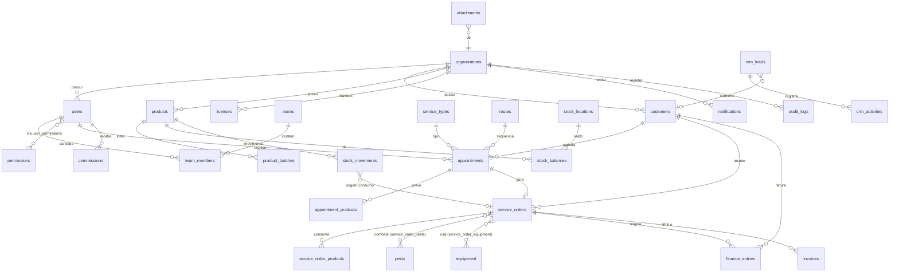

# Banco de dados — Na Mira · Controle de Pragas

Modelagem PostgreSQL normalizada, multi-tenant e auditável.
Arquivos: [`db/schema.sql`](../db/schema.sql) (DDL), [`db/rls.sql`](../db/rls.sql)
(Row Level Security) e [`db/auth_hook.sql`](../db/auth_hook.sql) (claims do JWT).

> **Ordem de aplicação no Supabase**: `schema.sql` → `rls.sql` → `auth_hook.sql`
> → registrar o hook em Authentication → Hooks → Custom Access Token
> (selecionar `public.custom_access_token_hook`). Sem esse último passo no
> painel, as políticas de RLS negam tudo (fail-closed) — o app não funciona,
> mas nenhum dado vaza.

## Convenções

- **Multi-tenant** por `org_id` em toda tabela de negócio (habilite RLS no Supabase).
- Chaves primárias **UUID** (`gen_random_uuid()`).
- **timestamptz** para datas/horas; `created_at` / `updated_at` (trigger automático).
- **ENUMs** para estados de domínio; catálogos em tabelas quando extensíveis.
- Soft-delete via `deleted_at` onde há necessidade de histórico.

## Domínios (ENUMs)

| ENUM | Valores |
| --- | --- |
| `user_role` | admin, supervisor, financeiro, atendimento, estoque, tecnico |
| `customer_type` | pf, pj |
| `appointment_status` | programada, agendado, confirmado, em_deslocamento, em_atendimento, finalizado, cancelado, reagendado |
| `appointment_priority` | baixa, normal, alta, urgente |
| `service_order_status` | rascunho, em_andamento, concluida, cancelada |
| `stock_movement_type` | entrada, saida, transferencia, consumo, perda, ajuste, devolucao |
| `stock_location_kind` | central, tecnico, veiculo |
| `finance_entry_type` | receita, despesa |
| `finance_entry_status` | pendente, pago, atrasado, cancelado |
| `crm_stage` | novo_contato, orcamento, negociacao, follow_up, ganho, perdido |
| `equipment_status` | disponivel, em_uso, manutencao, inativo |

## Diagrama de relacionamentos (visão macro)



## Tabelas por área

### Núcleo & acesso
`organizations`, `users`, `permissions`, `role_permissions`, `user_permissions`,
`teams`, `team_members`.

### Comercial / CRM
`customers`, `crm_leads`, `crm_activities`.

### Catálogo & estoque
`suppliers`, `product_categories`, `products`, `product_batches`,
`stock_locations`, `stock_balances`, `stock_movements`.

> **Estoque em dois níveis**: `stock_locations.kind` distingue `central`,
> `tecnico` e `veiculo`. Saldos ficam em `stock_balances`; toda alteração passa
> por `stock_movements` (auditável). Consumo de OS baixa do local do técnico.

### Operação
`service_types`, `pests`, `treated_areas`, `appointments`, `appointment_products`, `routes`,
`service_orders`, `service_order_products`, `service_order_pests`,
`service_order_equipment`, `checklist_templates`, `checklist_runs`, `attachments`.

> **Catálogo operacional** (`service_types`, `pests`, `treated_areas`):
> `is_active` controla a seleção em novas OS sem afetar OS/documentos já
> emitidos (ausente = ativo). `service_orders.recurrence` guarda o plano de
> recorrência multi-fase (fases com frequência + nº de ocorrências); as
> visitas futuras geradas ficam em `appointments`, agrupadas por
> `recurrence_id` — nascem como `programada` e só avançam para `agendado`
> (aguardando confirmação) dentro da janela de confirmação (3 dias para
> serviços semanais, 7 para os demais), nunca sendo liberadas ao técnico
> antes de `confirmado`.

### Recursos
`equipment`, `equipment_maintenance`, `vehicles`, `vehicle_fuel_logs`,
`vehicle_maintenance`.

### Financeiro & fiscal
`finance_accounts`, `finance_categories`, `finance_entries`, `commissions`,
`fiscal_settings`, `invoices`, `licenses`, `inspections`.

### Sistema
`notifications`, `audit_logs`.

## Row Level Security (Supabase)

As políticas prontas estão em [`db/rls.sql`](../db/rls.sql): habilita RLS em
todas as tabelas com `org_id`, cria isolamento por organização, restringe o
**técnico** aos próprios atendimentos/OS/estoque e bloqueia os módulos
financeiro/fiscal para o papel técnico. Exemplo do padrão usado:

```sql
alter table appointments enable row level security;

create policy "org isolation" on appointments
  for all
  using (org_id = (auth.jwt() ->> 'org_id')::uuid);

-- Técnico só enxerga os próprios atendimentos:
create policy "tecnico vê os seus" on appointments
  for select
  using (
    org_id = (auth.jwt() ->> 'org_id')::uuid
    and (
      (auth.jwt() ->> 'role') <> 'tecnico'
      or technician_id = (auth.jwt() ->> 'user_id')::uuid
    )
  );
```

## Como aplicar

```bash
# PostgreSQL local
psql "$DATABASE_URL" -f db/schema.sql
psql "$DATABASE_URL" -f db/rls.sql     # políticas de Row Level Security
psql "$DATABASE_URL" -f db/seed.sql

# Supabase (CLI)
supabase db push        # ou aplique db/schema.sql como migration
```
